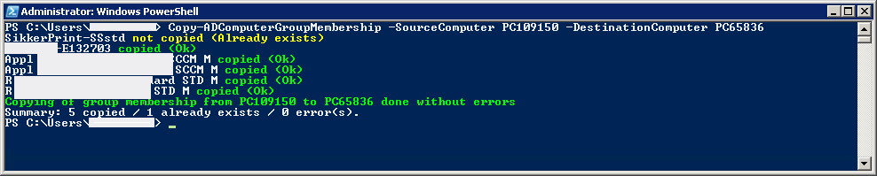
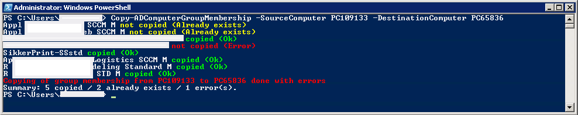

# Copy-ADComputerGroupMembership
A PowerShell function to copy all Active Directory Group Memberships from one computer to another.

**Description**  
   A function to copy all group memberships from one computer to another in Active Directory.   
   The ActiveDirectory module is required for this function to work.
   Avaiable in RATS https://www.microsoft.com/en-us/download/details.aspx?id=45520
  
**Requirements**
* Windows PowerShell (tested on v4)
* ActiveDirectory PowerShell module
  https://docs.microsoft.com/en-us/powershell/module/addsadministration/

**Instructions**

Load function:
```powershell
Import-Module .\Copy-ADComputerGroupMembership.ps1
```

Run function:
```powershell
Copy-ADComputerGroupMembership -SourceComputer Computer-A -DestinationComputer Computer-B
```
**Script examples**

Run function as a Wizard:
```powershell
Do
{
$source = Read-Host "Source Computer"
$destination = Read-Host "Destination Computer"
Copy-ADComputerGroupMembership -SourceComputer $source -DestinationComputer $destination
} while ($true)
```
Run function to batch-copy list of computers for .txt-file:
```powershell
foreach($line in Get-Content .\list.txt)
	{
	$source = $line.Split(",")[0]
	$destination = $line.Split(",")[1]
 	Write-Host "Initiating copying of group memberships from $source to $destination."
	Copy-ADComputerGroupMembership -SourceComputer $source -DestinationComputer $destination
	Write-Host "copying of group memberships from $source to $destination finished"
	}		
Read-Host "Press any key to exit..."
```
list.txt
```
SourceComputerA,DestinationComputerA
SourceComputerB,DestinationComputerB
SourceComputerC,DestinationComputerC
```


**Screenshots**  





**Changelog**  
* 31.07.2018
    * Release
